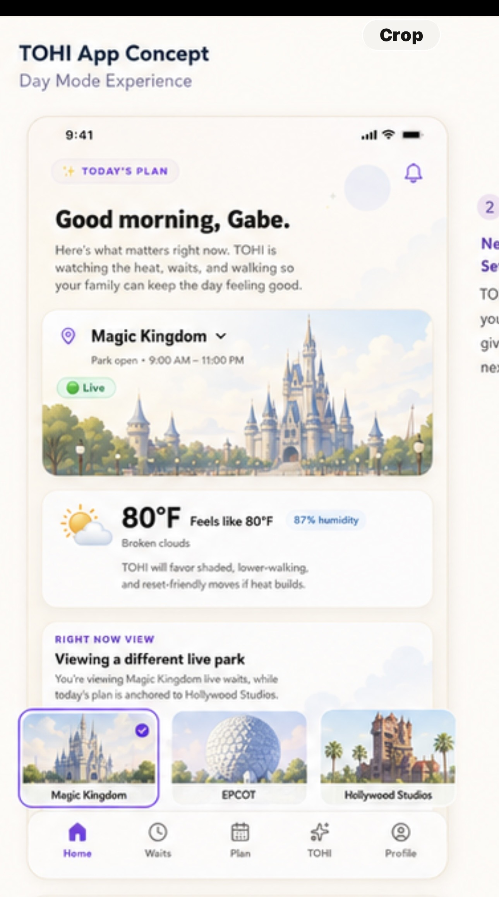
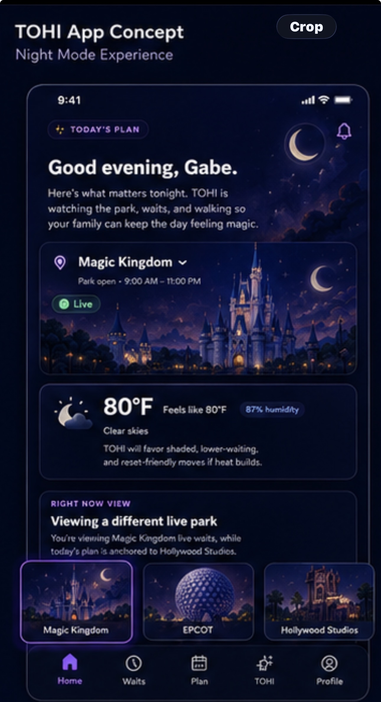

# TOHI Approved Redesign Visual Guardrails

This document locks the visual direction for the TOHI premium redesign based on the approved day-mode and night-mode mockups.

## Product intent

TOHI should feel like a calm, premium family park-day companion. The design should support TOHI Pick, real-time clarity, weather comfort, family context, and simple next-step guidance without feeling loud, generic, or overly gamified.

## Day mode direction

Day mode should match the approved warm, polished mockup:

- Warm cream app background, not bright white and not saturated gradient-heavy.
- White and soft cream cards with subtle borders.
- Lavender/purple as an accent, not a dominant full-card wash.
- Soft shadows with rounded mobile-first cards.
- Premium illustrated park panels inside cards.
- Clear hierarchy: greeting, live park status, weather/comfort, right-now context, recommendations.
- Calm, friendly, family-focused tone.
- Use small colored pills for status, wait, confidence, and category labels.
- The experience should feel polished and breathable, not crowded or loud.

## Night mode direction

Night mode should match the approved deep navy mockup:

- Deep navy app shell.
- Dark cards with thin borders and subtle purple glow.
- Purple accents and soft highlight states.
- Illustrated night panels with dark blue/purple atmosphere.
- High contrast text that stays readable.
- Calm nighttime energy, not neon overload.
- Use glow sparingly around active elements, recommendation cards, and app shell surfaces.

## Recommendation / TOHI Pick direction

TOHI Pick and recommendation cards should follow the approved card style:

- Clear slot label such as Best Move, Smart Backup, or Plan Ahead.
- Attraction name is prominent.
- Wait pill is visible and easy to scan.
- Short family-context reason under the title.
- Illustration/art panel sits inside the card, usually on the right or as a contained image area.
- Action buttons remain clear: In Line, Done, Skip, Report.
- TOHI Pick can be elevated, but it should not become a giant loud purple/orange gradient hero block.
- The engine decides the pick; visual work only changes presentation.

## What to avoid

- Loud purple/orange gradient hero treatments.
- Generic SaaS dashboard styling.
- Cold gray surfaces.
- Flat white cards with no warmth.
- Overly bright gradients used as the main visual identity.
- Replacing calm guidance with flashy visuals.
- Changing recommendation scoring or TOHI Pick logic during visual-only passes.

## Implementation rule

Before wiring any new screen visuals, compare the change against the approved day and night mockups. If it does not look like it belongs in those mockups, stop and adjust the component or token direction first.

## Approved Home blueprint

Phase 62B. The approved Home day-mode and night-mode blueprints are preserved in this repository:

| Mode | Reference |
|------|-----------|
| Day | [`docs/design/home-62b-day.jpg`](./design/home-62b-day.jpg) |
| Night | [`docs/design/home-62b-night.jpg`](./design/home-62b-night.jpg) |

These are design references, not production artwork. Do not crop, resize, recompress, redraw, or use any portion of these files inside the production UI.

### Scope of the reference

The phone-screen content is the reference. Everything around it is an artifact of how the concept was captured and is excluded:

- the Photos Crop control
- the "TOHI App Concept / Day Mode Experience" and "Night Mode Experience" heading
- the device frame and status bar
- any adjacent concept panel visible at the edge of the screenshot
- all other screenshot chrome

### Locked Home hierarchy

1. Today's Plan eyebrow/header treatment.
2. Time-aware personalized greeting and short TOHI guidance.
3. Selected-park artwork card with park artwork, park name, available operating information, and live/freshness state.
4. Illustrated weather/comfort card with temperature, feels-like, humidity, condition, and TOHI comfort guidance.
5. Complete Right Now View when the live park differs from the planned park.
6. Illustrated four-park selector.
7. Bottom navigation matching Home's active day/night mode.

### All four selectable Disney parks remain available

The mockups show three selector cards only because the fourth is off-screen. Animal Kingdom is not removed. Magic Kingdom, EPCOT, Hollywood Studios, and Animal Kingdom all remain reachable through horizontal scrolling.

### What the references lock, and what they do not

The references lock hierarchy and visual language.

They do not lock, and must never be copied into code as literal values:

- temperatures, feels-like values, or humidity
- operating hours or park status
- which park is shown or selected
- live/freshness state
- exact supporting copy

The supporting sentences differ slightly between the day and night references. That is a visual example, not authorization for new copy logic. Preserve existing Home wording and behavior unless a later brief explicitly approves a copy change.

### Production data is authoritative

Home renders what the app actually knows. Never hardcode a value from the mockups. Show only operating information the app genuinely provides. When operating information is unavailable, preserve the current omission behavior. Home currently has no dedicated pre-open, open, or closed presentation; a later visual phase must not invent an authoritative status from the static schedule. Static schedules may only be presented cautiously as typical hours.

### Refined artwork is required

This redesign requires refined day and night artwork for both the park cards and the weather card. Each park needs a day and a night master, composed and visually reviewed for both the wide hero crop and the selector-thumbnail crop. Ride artwork must not be borrowed as a Home placeholder.

Missing or unusable artwork renders a deliberately composed no-art state, never an emoji, a generic placeholder, or a borrowed illustration.

### Excluded until genuine behavior exists

Two controls appear in the references and are not approved for production:

- the notification bell
- the chevron beside the park name

Neither has real behavior behind it, and TOHI does not ship fake interactive controls. The illustrated park selector is the park-changing control. Add either of these only when genuine behavior exists to support it.

### Dynamic states absent from the mockups must remain

The references show one healthy moment. Every state they do not show still has to render, and must be given a deliberate home in the hierarchy above:

- arrival confirmation and park-check prompts
- current-line status and its actions
- While You Wait
- initial loading and refresh-in-progress
- stale data, error, and unavailable-data states
- weather unavailable

None of these may be dropped in the course of matching the blueprint.

### Approved weather principle

Current conditions drive the artwork. Upcoming conditions appear as guidance.

Home must never show storm or rain artwork while current conditions are clear. Upcoming rain or storm risk belongs in messaging or a status badge, not in the illustration.

Heat artwork may be driven by current effective temperature, because that represents a current condition.

Weather that is missing or unusable renders the composed no-art state.

### Operating-hours wording must stay cautious

Park hours come from a static local schedule with a weekly fallback, not from a live operating-hours feed. Wording must reflect that, for example "Typical hours".

A static schedule must never be presented as official live hours. This follows the existing rule in `CLAUDE.md`: never say something is official unless the metadata supports it, and never create fake certainty.
